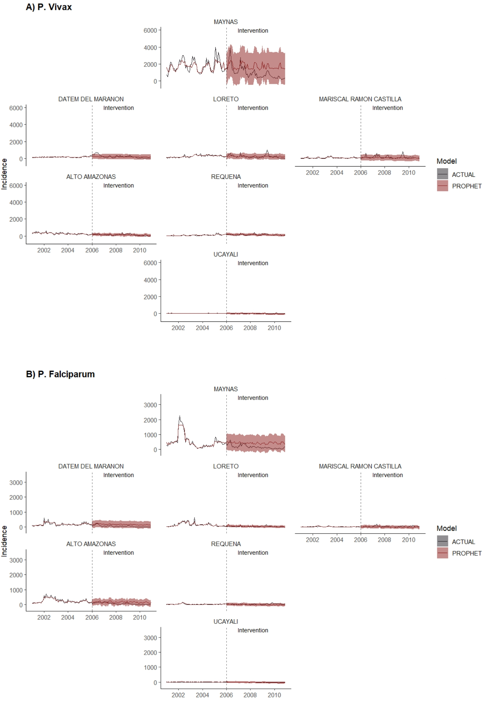

`ITS-ML LORETO`
================
`R` code and outputs to support [Carrasco-Escobar G](https://github.com/gcarrascoe),[Jesús M. Quispe Quispe](https://jesusrqp96.github.io/JesusQuispe), Arnab K. Dey, Changwoo Han, François Rerolle, Verónica Soto, Hugo Rodrigues, Alejandro Llanos-Cuentas, Tarik Benmarhnia. **Two-Stage Interrupted Time Series Analysis with Machine Learning: Evaluating the Effectiveness of Malaria Interventions in Peru as a Case Study**


<p align="center">

</p>

<i><b>Figure 1 : Evolution of actual and counterfactual malaria incidence by species in pre-and post-PAMAFRO intervention period.</i>
</p>


--------------------------
Study description
================
This study proposes that malaria interventions contributed in reducing malaria incidence during the period of their effectiveness, even when considering seasonal climate factors such as temperature and precipitation. We assessed  these two interventions using monthly malaria incidence data for Plasmodium vivax and P. falciparum in Loreto, Peru (2001–2019). Employing a two-stage machine learning model, 
we examined how both the **PMC** and **PAMAFRO** interventions contributed to reducing malaria incidence.


----------------

Repository structure
================

<details>
  <summary>Data</summary>
  Data Employed to reproduce the results
  <ul>
    <li><a href="https://github.com/healthinnovation/ITS_ML_LORETO/blob/main/Data/db_loreto_its.rds">db_loreto_its.rds </a></li> 
    <li><a href="https://github.com/healthinnovation/ITS_ML_LORETO/blob/main/Data/peru.rds"> peru.rds  </a></li> 
  </ul>
</details>


  
<details>
  <summary> Analysis </summary>
   R markdowns and outputs. 
  <ul>
    <li><a href="https://github.com/healthinnovation/ITS_ML_LORETO/blob/main/Analysis/02_Calculate_ML.Rmd">02_Calculate_ML </a></li>  

  `R` markdown for data preparation,preprocessing and model building.
    
  </ul>
  <ul>
    <li><a href="https://github.com/healthinnovation/ITS_ML_LORETO/blob/main/Analysis/03_Results.Rmd">03_Results  </a></li> 
    
   `R` markdown to present the results of the data analysis.

  </ul>
  <ul>
    <li><a href="https://github.com/healthinnovation/ITS_ML_LORETO/tree/main/Analysis/fit_preintervention"> fit_preintervention </a></li> Folder with the fitted values in comparison to training dataset
    <li><a href="https://github.com/healthinnovation/ITS_ML_LORETO/tree/main/Analysis/forecast_intervention"> forecast_intervention </a></li> Folder with the forecasted values in comparison to test dataset
    <li><a href="https://github.com/healthinnovation/ITS_ML_LORETO/tree/main/Analysis/models_postuning"> models_postuning  </a></li> Folder with the models per intervention per specie
  </ul>
</details>

<details> 
  <summary> Others </summary>
  
- .gitignore
- .Rprofile
- README.md
- [ITS_ML.Rproj](ITS_ML.Rproj) `R` project file.


</details>

----------------


`R` environment and version
================
Detailed information about the `R` environment and version used for running this project.

```bash
               _                           
platform       x86_64-w64-mingw32          
arch           x86_64                      
os             mingw32                     
system         x86_64, mingw32             
status                                     
major          4                           
minor          3.1                         
year           2023                        
month          06                          
day            16                          
svn rev        84548                      
language       R                           
version.string R version 4.3.1 (2023-06-16 ucrt)
nickname       Beagle Scouts 
```
